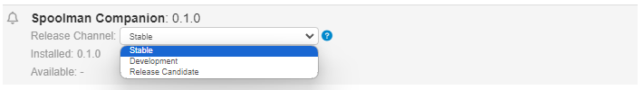

# Spoolman integration for OctoPrint

[](https://github.com/mkevenaar/OctoPrint-Spoolman/releases)
[](https://github.com/mkevenaar/OctoPrint-Spoolman/releases)


Report filament usage to Spoolman.

:warning: An installation of [Spoolman](https://github.com/Donkie/Spoolman#installation) is required!

The UI and inner works of this companion plugin are based on [OctoPrint-SpoolManager](https://github.com/OllisGit/OctoPrint-SpoolManager) by [OllisGit](https://github.com/OllisGit).

## Support my Efforts

This plugin is developed in my spare time.
If you like it, I would be thankful for a cup of coffee, or a sponsorship :)

[](https://github.com/sponsors/mkevenaar)

[](https://www.buymeacoffee.com/mkevenaar)

[](https://www.patreon.com/mkevenaar)

## Included features

* [x] Software odometer to track amount of extruded filament
* [ ] Warns you if the selected spool has not enough filament left for the print job
* [ ] Automatically pause print if filament runs out

## Setup

Install via the bundled [Plugin Manager](https://docs.octoprint.org/en/master/bundledplugins/pluginmanager.html)
or manually using this URL:

    https://github.com/mkevenaar/OctoPrint-Spoolman/archive/main.zip

After installation, you can listen on three release channels.
What does this mean: Each channel has its own release-version and each release has a different kind of functionality and stability.

* **"Only Release"**: Only stable and tested versions will be shown in the software-update section of OctoPrint
* **"Release & Candidate"**: Beside the stable release, you can also see the "release-candidates", like '''0.1.0rc1'''.
  The rc's include new functionality/bugfixes and are already tested by the community.. so by YOU ;-)
* **"Release & Candidate & under Development"**: Beside stable and rc, you will be informed about development versions.
  A development version like '''0.2.0.dev5``` could include a new (experimental) feature/bugfixes, but it is not fully tested by the community

Changing between each release is done via the "Software Update section" in the settings.


Hint: "Easy-switching" is possible with OctoPrint-Version 1.8.0 (see [OctoPrint#4238](https://github.com/OctoPrint/OctoPrint/issues/4238)).
At the meantime you need to uninstall and install the version you like from the selected channel...or stay in one channel ;-)

## Versions

see [Release-Overview](https://github.com/mkevenaar/OctoPrint-Spoolman/releases/)
